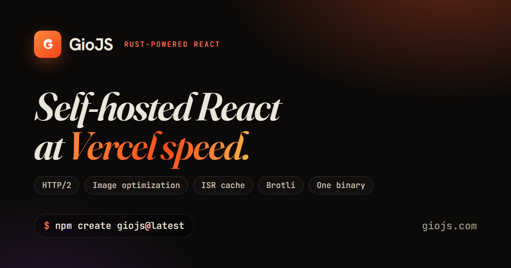

<div align="center">



# GioJS

**The Rust-powered React framework.** Self-hosted React at Vercel speed.

[](https://www.npmjs.com/package/@gio.js/server)
[](https://www.npmjs.com/package/create-giojs)
[](LICENSE)
[](https://giojs.com)

[**Website & Docs →**](https://giojs.com)

</div>

---

GioJS gives every developer the performance profile that a managed cloud provides — image optimization, brotli compression, HTTP/2, ISR caching, font self-hosting, rate limiting, i18n routing, and WebSockets — **without a CDN and without a cloud tax.** The hot path runs in compiled Rust; React SSR runs in Node. Memory stays flat under load because Rust owns the HTTP server and Node only renders.

## Get started

```bash
npm create giojs@latest
```

Pick TypeScript/JavaScript and **Server app** or **Static site** at the prompt, then `npm run dev`. Static sites build to plain HTML with `gio export` and deploy free to any static host.

## Why GioJS

| Feature | Self-hosted Next.js | GioJS |
|---|---|---|
| Image optimization | ❌ managed cloud only | ✅ Built-in (Rust) |
| Brotli compression | ❌ manual nginx config | ✅ Automatic |
| HTTP/2 | ❌ needs a reverse proxy | ✅ Built-in |
| ISR cache | ❌ managed cloud only | ✅ Built-in |
| Font self-hosting | ❌ manual setup | ✅ Automatic |
| Memory stability | ⚠️ known OOM issues | ✅ Flat profile (Rust HTTP) |
| Rate limiting | ❌ third-party required | ✅ Built-in (token bucket) |
| i18n routing | ⚠️ complex configuration | ✅ Built-in |
| WebSocket | ❌ separate server needed | ✅ Built-in |
| Static export | ✅ | ✅ `gio export` |

## Architecture

Incoming requests hit a Rust HTTP server (axum + hyper) which handles TLS, routing, compression, caching, image processing, and static file serving — without ever touching Node. Only cache-missed dynamic routes cross the IPC boundary (a named pipe on Windows, a Unix socket on Linux/macOS) to a persistent Node worker that runs React SSR via `renderToReadableStream`. Rendered HTML returns to Rust for compression, caching, and delivery.

Read more: [**How GioJS works →**](https://giojs.com/docs/architecture)

## Packages

| Package | Description |
|---|---|
| [`create-giojs`](https://www.npmjs.com/package/create-giojs) | Project scaffolder (`npm create giojs`) |
| [`@gio.js/server`](https://www.npmjs.com/package/@gio.js/server) | The server — Rust binary + Node bridge |
| [`@gio.js/react`](https://www.npmjs.com/package/@gio.js/react) | React components (`GioLink`, `GioImage`, `GioFont`) |
| [`@gio.js/core`](https://www.npmjs.com/package/@gio.js/core) | Internal Node runtime + static export |

## Links

- 🌐 **Website & docs** — https://giojs.com
- 📦 **npm** — https://www.npmjs.com/package/create-giojs
- 📋 **Releases** — https://giojs.com/releases

## Status

Public beta. See [the changelog](CHANGELOG.md) and [releases](https://giojs.com/releases).

MIT © GioJS
