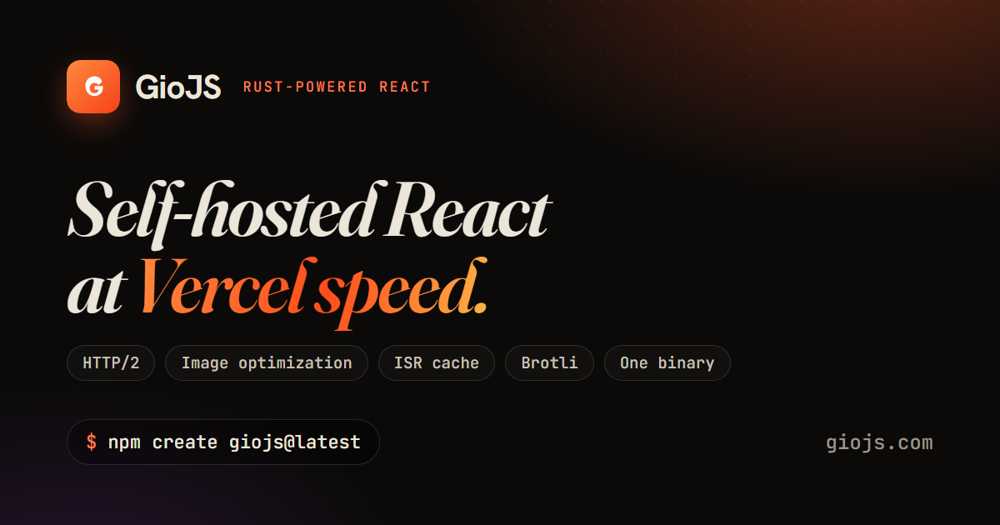

<div align="center">



# GioJS

**The Rust-powered React framework.** Self-hosted React at Vercel speed.

[](https://www.npmjs.com/package/@gio.js/server)
[](https://www.npmjs.com/package/create-giojs)
[](LICENSE)
[](https://giojs.com)

[**Website & Docs →**](https://giojs.com)

</div>

---

GioJS gives every developer the production stack a managed cloud provides - HTTP/2, brotli compression, image optimization, an ISR page cache, font self-hosting, rate limiting, security headers, sessions and WebSockets - **without a CDN and without a cloud tax.** The hot path runs in compiled Rust; React SSR runs in a pool of supervised Node workers. Memory stays flat under load because Rust owns the HTTP server and Node only renders.

## Get started

```bash
npm create giojs@latest
```

The scaffolder asks for a name, TypeScript or JavaScript, **Server app** or **Static site**, and whether to install dependencies, then makes the first git commit. Start it with `npm run dev`.

Skip the prompts with flags:

```bash
npm create giojs@latest my-app -- --ts --server
npm create giojs@latest -- --help        # every option
```

Then read [Installation](https://giojs.com/docs/installation), [Deploying](https://giojs.com/docs/guides/deploying) and the [production checklist](https://giojs.com/docs/guides/production-checklist). Coming from Next.js? `npm create giojs@latest -- migrate` converts the project - see [Migrating from Next.js](https://giojs.com/docs/migration).

## What's in the box

| Area | What GioJS does |
|---|---|
| HTTP | HTTP/2 (h2c or TLS via rustls), brotli/gzip, connection limits and slowloris timeouts - in Rust |
| Caching | ISR page cache (memory + disk) with stale-while-revalidate, partial prerendering, `revalidateTag` / `revalidatePath`, `POST /_gio/revalidate` for CMS webhooks, `X-Gio-Cache` on every response |
| Routing | File-based `app/` routes, nested layouts, dynamic and catch-all segments, route groups, per-folder loading/error/not-found, typed `href()`, declarative middleware (redirects, rewrites, headers, guards) run in Rust |
| Data | `getServerSideProps`, page actions with progressively enhanced `<GioForm>`, `route.ts` API handlers, streamed responses, SSE, WebSockets with rooms and auth |
| Security | Default security headers, CSP with per-response nonces, CSRF and WebSocket origin checks, trusted proxies and request ids, rate limiting, locked-down dev endpoints |
| Auth | Encrypted, signed cookie sessions and `require_session` guards verified in Rust before Node runs |
| Assets | CSS imports and CSS Modules (Lightning CSS), image optimization (AVIF/WebP), self-hosted fonts, `public/` at the site root |
| SEO | Metadata API with title templates, `sitemap.ts` / `robots.ts` / `manifest.ts`, `<JsonLd>` |
| Config | `.env` files, `GIO_PUBLIC_*` client variables, a server-only guard, strict `gio.toml` with a JSON Schema |
| Operations | Worker pool, health checks, Prometheus metrics by route, JSON logs, graceful shutdown, standalone builds, static export |
| Testing | `@gio.js/core/testing`: `renderPage`, `callRoute`, `createTestServer` |

## Compared with self-hosted Next.js

What you get from `next start` on your own server versus GioJS, out of the box:

| | Self-hosted Next.js | GioJS |
|---|---|---|
| Image optimization | ✅ in Node (sharp) | ✅ in Rust, with a disk cache |
| ISR page cache | ✅ per instance | ✅ per instance, in Rust memory + disk |
| On-demand revalidation | ✅ | ✅ plus an authenticated HTTP endpoint |
| HTTP/2 | ❌ needs a reverse proxy | ✅ built in |
| Brotli | ❌ gzip only | ✅ brotli + gzip |
| Security headers | ❌ write them yourself | ✅ on by default |
| CSP nonces | ⚠️ hand-written middleware, pages go dynamic | ✅ one line, works with cached pages |
| CSRF protection | ⚠️ Server Actions only | ✅ every unsafe request to pages and routes |
| Sessions | ❌ third-party library | ✅ built in, guards verified in Rust |
| Rate limiting | ❌ third-party | ✅ built in (token bucket) |
| WebSockets | ❌ separate server | ✅ built in, with rooms |
| Forms | ✅ Server Actions | ✅ page actions + `<GioForm>` |
| Multi-core rendering | ⚠️ run and balance processes yourself | ✅ `[server] workers` pool |
| Testing helpers | ⚠️ bring your own | ✅ `@gio.js/core/testing` |
| Static export | ✅ | ✅ `gio export`, hydrated |
| React Server Components | ✅ | ❌ not supported |
| Generated OG images | ✅ | ❌ not supported |
| Shared cache across instances | ⚠️ custom cache handler | ❌ not yet - each instance has its own |

See [Known Limitations](https://giojs.com/docs/known-issues) for everything GioJS does not do yet.

## Architecture

Incoming requests hit a Rust HTTP server (axum + hyper) which handles TLS, routing, compression, caching, security checks, image processing, and static file serving - without ever touching Node. Only cache-missed dynamic routes cross the IPC boundary (a named pipe on Windows, a Unix socket on Linux/macOS) to a pool of persistent Node workers that run React SSR via `renderToReadableStream`. Rendered HTML returns to Rust for compression, caching, and delivery.

Read more: [**How GioJS works →**](https://giojs.com/docs/architecture)

## Packages

| Package | Description |
|---|---|
| [`create-giojs`](https://www.npmjs.com/package/create-giojs) | Project scaffolder (`npm create giojs`) and the Next.js migration tool |
| [`@gio.js/server`](https://www.npmjs.com/package/@gio.js/server) | The server - Rust binary + the `gio` CLI |
| [`@gio.js/core`](https://www.npmjs.com/package/@gio.js/core) | The Node runtime and server APIs: types, sessions, revalidation, metadata, testing, static export |
| [`@gio.js/react`](https://www.npmjs.com/package/@gio.js/react) | Client components and hooks (`GioLink`, `GioImage`, `GioForm`, `JsonLd`, router hooks) |

## Links

- 🌐 **Website & docs** - https://giojs.com
- 📦 **npm** - https://www.npmjs.com/package/create-giojs
- 📋 **Releases** - https://giojs.com/releases
- 🔒 **Security policy** - [SECURITY.md](SECURITY.md)

## Status

Public beta. See [the changelog](CHANGELOG.md) and [releases](https://giojs.com/releases).

MIT © GioJS
